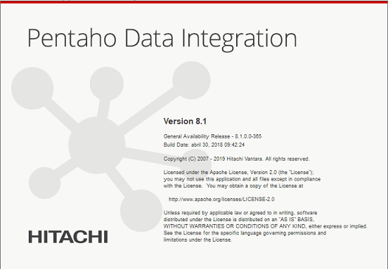
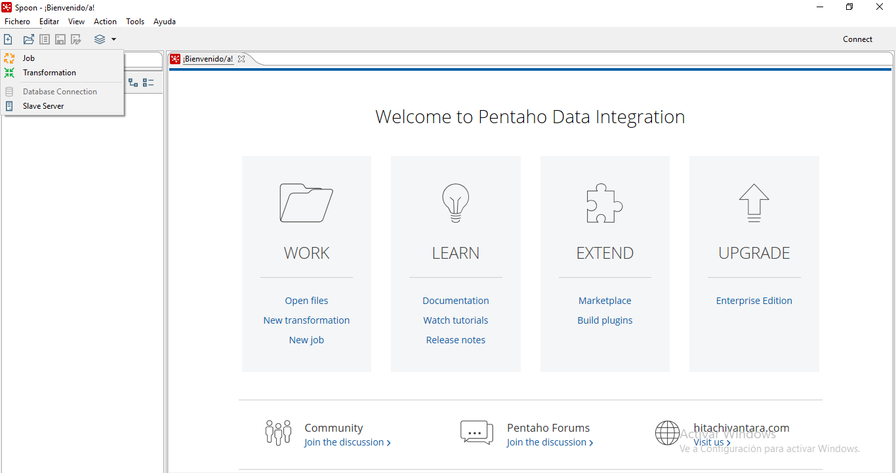
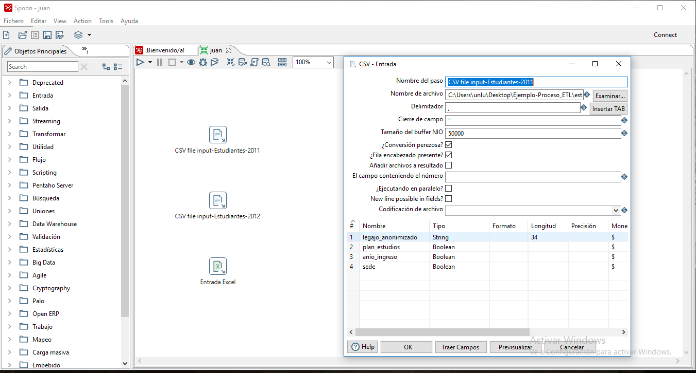
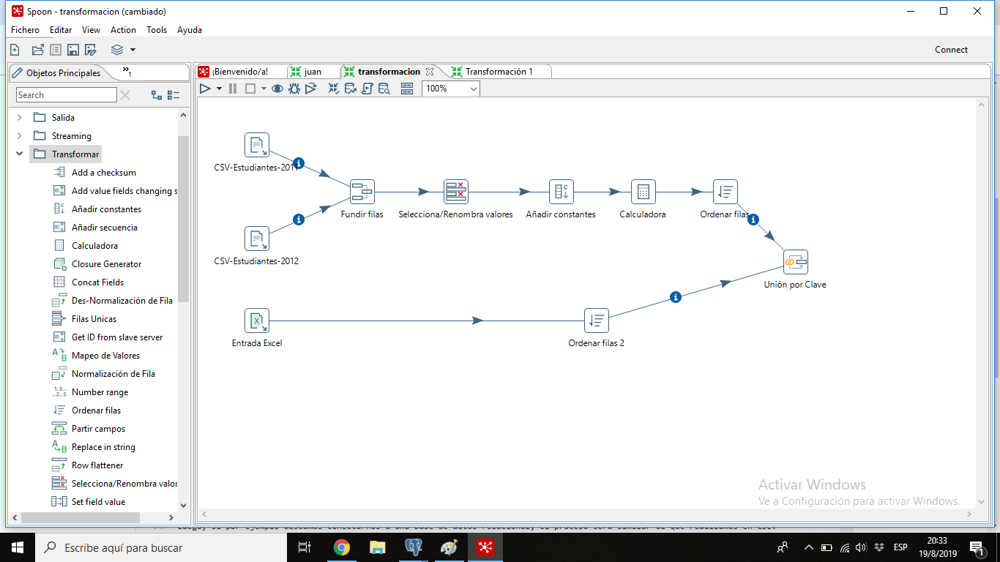
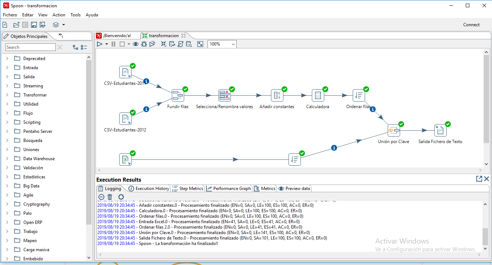
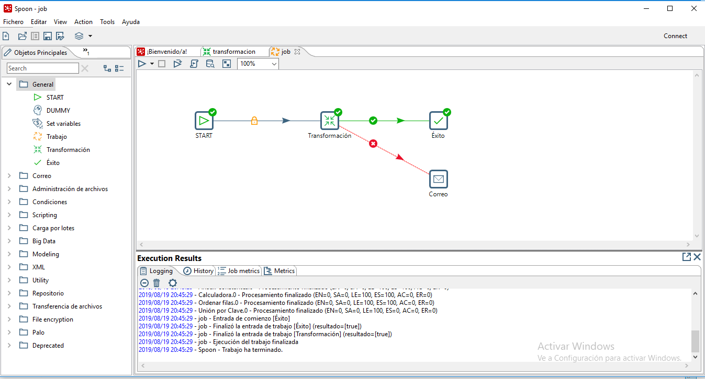

# Guía de LABORATORIO: Definición de Procesos ETL con Pentaho Data Integration (Pentaho)

## Introducción a Pentaho Data Integration
Pentaho Data Integration (PDI) es la herramienta de integración de datos de la Suite Pentaho. La misma provee capacidades de Extracción, Transformación y Carga (ETL) para facilitar los procesos de captura, limpieza y almacenamiento de datos utilizando un formato uniforme.
Podemos acceder a información mas detallada de la herramienta ingresando [acá.](https://help.pentaho.com/Documentation/8.3/Products/Pentaho_Data_Integration) Esta guía está basada en la documentación oficial de la herramienta.

Los usos comunes de Pentaho Data Integration incluyen:
- Migración de datos entre diferentes bases de datos y aplicaciones.
- Carga de grandes conjuntos de datos en bases de datos aprovechando al máximo los entornos de procesamiento en la nube.
- Limpieza de datos con pasos que van desde transformaciones muy simples hasta muy complejas
- Integración de datos, incluida la capacidad de aprovechar ETL en tiempo real como fuente de datos para Pentaho Reporting.
- Carga de datos en Data Warehouse con soporte integrado para dimensiones que cambian lentamente, con creación de claves subrogadas.

## Conceptos básicos de Pentaho Data Integration (PDI)
Pentaho Data Integration del PDI Client (también conocido como Spon y Kettle) utiliza una perspectiva o enfoque de trabajo tipo workflow implementado a partir de un grafo dirigido conformado por un conjunto de __steps__ (pasos) -que corresponden a los nodos del grafo- unidos y relacionados a partir de __hops__ (saltos) -que equivalen a las arístas-. 

A su vez, estos procesos ETL poseen dos niveles de granularidad o abstracción, y esos dos niveles están representados a partir de lo que en los procesos de integración se denominan __transformations__ y __jobs__:
- Una __transformation__ es una red de tareas lógicas llamadas pasos, relacionados a través de saltos. Las transformaciones son esencialmente flujos de datos; es, en esencia, un grafo dirigido de un conjunto lógico de configuraciones de transformación de datos. Los nombres de los archivos de transformación tienen una extensión .ktr. Como ya dijimos, las transformaciones están conformadas por steps y hops:
  - Los __steps__ (que representan los nodos del grafo) son los componentes más básicos de una transformación que permiten, por ejemplo, una entrada de archivo de texto o una salida de tabla. Hay muchos pasos disponibles en Pentaho Data Integration y se agrupan según la función; por ejemplo, entrada, salida, secuencias de comandos, etc. Cada paso de una transformación está diseñado para realizar una tarea específica, como leer datos de un archivo plano, filtrar filas e iniciar sesión en una base de datos
  - Por su parte, los __hops__ (que representan las aristas) se utilizan para conectar logicamente los steps de una transformación y definir la secuencia que los datos siguen en el grafo. Esos hops determinan el flujo de datos a través de los pasos pero no necesariamente la secuencia en la que se ejecutan.

Así, las las transformaciones son el entorno de PDI donde las extracciones de datos, la integración, las transformaciones y la carga de los mismos suceden. Un proceso ETL está formado, usualmente, por varias transformaciones con un conjunto de actividades lógicamente agrupadas que se relacionan entre sí.

- Los __jobs__ (trabajos) tiene la misma taxonomía que las transformaciones, pero con un nivel de abstracción mayor: permiten coordinar e integrar las transformaciones pre-existentes y complementarlas con actividades de soporte al Proceso ETL. Los trabajos incorporan esas piezas individuales de funcionalidad de las que antes hablamos para implementar el proceso completo. Los ejemplos de tareas comunes realizadas en un __job__ incluyen obtener archivos FTP, verificar condiciones como la existencia de una tabla de base de datos de destino necesaria, ejecutar una transformación que complete esa tabla y enviar un registro de error por correo electrónico si falla una transformación. El resultado final del trabajo podría ser una actualización nocturna de un Data Warehouse, por ejemplo.

Típicamente, un __Proceso ETL (Extract, Transform and Load)__ estará conformado por un único __Job__, el cual coordinará la ejecución de todo el proceso, que integrará varias transformaciones -los flujos y transformaciones definidas en los datos- definidas para ese proceso. Una forma tradicional en la cual se define el agrupamiento de actividades existentes en cada transformación es utilizando la regla de utilizar _una transformación por cada tabla en la Base de Datos destino_.

_Tips de utilización: En general, el proceso de diseño del Proceso ETL consiste en pensar lógicamente las diferentes transformaciones que serán parte del proceso, avanzar sobre la definición de las mismas y por último integrarlas en un job combinando las mismas con actividades de soporte (envío de correos, reportes de ejecución, aviso ante fallas, etc)_.

La lógica que explicamos antes no es únicamente válida para Pentaho Data Integration, sino que muchas de las herramientas de ETL respetan este paradigma. Otra opción interesante -que respeta este esquema de trabajo- de código abierto y con una versión gratuita es [Open Talend Studio](https://es.talend.com/products/talend-open-studio/).

## Utilización de PDI: Iniciando el camino hacia la integración de datos
Para ingresar a Pentaho Data Integration, debemos descomprimir la carpeta descargada desde la web de [Hitachi Vantara](https://community.hitachivantara.com) y ejecutar el archivo spoon (.sh en Ubuntu y .bat en Windows) luego de configurar la variable JAVA_HOME como se explica [aquí.](https://www.dropbox.com/s/au05tj4qn63h8xx/GL00%20-%20Gu%C3%ADa%20de%20Instalaci%C3%B3n%20Suite%20Pentaho.pdf?dl=0)

En la imagen se puede ver la distribución del home de la herramienta:
- A la izquierda se encuentra el panel de componentes (o potenciales nodos) con las diferentes funcionalidades que provee PDI para el consumo, transformación y carga de datos en las transformaciones y trabajos.
- En el centro, si bien en la imagen precedente se observa el home de bienvenida, estará el paño en blanco que representa el entorno donde modelaremos nuestro grafos incorporando los steps y hops.
- En la parte superior hay algunas opciones para la creación de archivos y conexión a orígenes de datos.

__Ejemplo de la Guia:__ En esta guía vamos a graficar los conceptos desarrollando un proceso ETL muy simple que integre tres archivos -dos csv y un xlsx- en un único archivo de texto. La idea es integrar, por un lado, un grupo de estudiantes del año 2011 con otro grupo de 2012 en un único archivo donde ambos cuentan con el número de legajo, el plan de estudios, la sede y el año de ingreso. Luego, poder integrar esta información con la información correspondiente a su carrera (nombre y cantidad de materias) sabiendo que el código de plan de estudios determina el código de plan.

## Paso 1: Creación de las Transformaciones
Como dijimos, en general utilizaremos un enfoque _bottom-up_, definiendo primero la/las transformaciones que transforman e integran cada flujo de datos y luego unificaremos este proceso a través de un job. En el caso del ejemplo de la guía, consiste en un ejercicio muy sencillo pero que nos permitirá entender los conceptos de PDI antes abordados. Nuestro caso de integración constará de una única transformación -conformada por un conjunto de steps y hops- y un único job. 

1. Para crear una transformación debemos presionar sobre el extremo superior izquierdo -en el ícono con un documento y un signo "+"-,  eligiendo la opción __Transformation__. Una vez que creamos la transformación, aparecerá una nueva pestaña sobre el centro de la herramienta, con el paño en blanco y con el panel con las posibles actividades que podemos realizar a la izquierda de la pantalla.
2. Estas actividades, que serán nuestros steps, están separadas por categoría de acuerdo a la funcionalidad y parte del proceso ETL al cual corresponde. De esta manera, los steps o componentes abocados a la Extracción (E de ETL) de los datos desde un origen de datos los encontraremos en la categoría _Entrada_. Tipicamente, las transformaciones casi siempre inicial con un step que extrae datos desde una o varias fuentes de información. En nuestro caso tendremos 3, 2 _CSV file input_ y 1 _Entrada Excel_, las cuales se arrastran al paño con la modalidad _drag & drop_.
3. Cada componente requiere un conjunto de configuraciones distintas de acuerdo a su funcionalidad. En el caso de _CSV file input_ requiere que configuremos cual es el archivo a consumir, su ubicación y cuales son los campos que utilizaremos de ese archivo, pudiendo renombrarlos y cambiar su tipo de datos, entre otras configuraciones. El proceso es similar para _Entrada Excel_ donde además debemos escoger cua/cuales hojas de la Planilla utilizaremos. Accedemos a la configuración de cada componente presionando doble click sobre el step.

4. Una vez configuradas las E del Proceso ETL, avanzaremos sobre las transformaciones sobre los datos para la posterior integración:
    - En primer lugar, lo que haremos -en la parte superior del grafo- es integrar en un único archivo los datos de los estudiantes del año 2011 y 2012, los cuales poseen el mismo formato. Para ello usamos el componente _Fundir Filas_ que está en la categoría _Uniones_ (todas las herramientas para uniones, joins, etc, se encuentran en esta categoría). La configuración es muy sencilla, solo requiere unir mediante hops los dos steps con los CSV a este nuevo que acabamos de crear y elegir el atributo de control de la unión para verificar que no existan repeticiones. 
    - Para crear hops -aristas del grafo- nos paramos encima del step y elegimos el ícono del cuadrado con la flecha de salida y arrastramos la flecha que aparece hasta el step que queremos unir.
    - Luego, haremos algunas transformaciones en los datos para poder realizar el join con el archivo de Carreras. Recordemos que tenemos el Código de Plan del Estudiante, y si a éste código lo dividimos por 100 y nos quedamos con la parte entera éste se convierte en el código de Carrera que es lo que necesitamos para _joiner_ ambos archivos. Para ello, renombramos los atributos (esto no es obligatorio), añadimos la constante 100 como columna del archivo y con el componente _Calculadora_ dividimos el Plan por 100 y nos quedamos con la parte entera. Todos estos componentes se encuentran en la categoría _Transformar_.
5. A continuación, solo nos queda joiner ambos archivos por el Código de Carrera. Para esto utilizamos el componente _Unión por Clave_ de la categoría _Uniones_. Una limitación de este componente es que ambos archivos deben estar ordenados por el campo clave que se utilizará para el join, operación que realizamos con el componente _Ordenar Filas_. El flujo de trabajo (que corresponde a la T de ETL basicamente) debería quedar parecido al de la siguiente imagen:
    

5. Por último, solo nos queda cargar los datos en el destino de datos, en nuestro caso un archivo de texto. Para ello utilizaremos el componente _Salida Fichero de Texto_ que se encuentra en la categoría _Salida_.
6. Una vez que culminamos el modelado de la transformación, podemos ejecutarla y debuggearla a través de los íconos que aparecen en la parte superior del paño de la transformación (ícono _Play_ para ejecutar). El resultado de la ejecución puede seguirse a partir de la ventana inferior central, donde aparecerán los eventuales errores que aparezcan.

## Paso 2: Integrando y dando soporte a las transformaciones a través del Job
Una vez definidas todas las transformaciones que formarán parte del Proceso ETL, vamos a integrarlas a partir de la definición de un __job__ cuyo objetivo es coordinar y administrar la ejecución del Proceso ETL brindando tareas de soporte como en este caso que enviará un correo al administrador cada vez que la ejecución falle. El esquema resultante es el siguiente:

Hasta aquí un breve instructivo con la utilización de Pentaho Data Integration, los archivos de datos utilizados, así como la transformation y el job definidos podés descargarlo de [acá]().
