# Guía de LABORATORIO: Definición de Procesos ETL con Pentaho Data Integration (Pentaho)

## Introducción a Pentaho Data Integration
Pentaho Data Integration (PDI) es la herramienta de integración de datos de la Suite Pentaho. La misma provee capacidades de Extracción, Transformación y Carga (ETL) para facilitar los procesos de captura, limpieza y almacenamiento de datos utilizando un formato uniforme.
Podemos acceder a información mas detallada de la herramienta ingresando [acá.](https://help.pentaho.com/Documentation/8.3/Products/Pentaho_Data_Integration)

Los usos comunes de Pentaho Data Integration incluyen:
- Migración de datos entre diferentes bases de datos y aplicaciones.
- Carga de grandes conjuntos de datos en bases de datos aprovechando al máximo los entornos de procesamiento en la nube.
- Limpieza de datos con pasos que van desde transformaciones muy simples hasta muy complejas
- Integración de datos, incluida la capacidad de aprovechar ETL en tiempo real como fuente de datos para Pentaho Reporting.
- Carga de datos en Data Warehouse con soporte integrado para dimensiones que cambian lentamente, con creación de claves subrogadas.

## Conceptos básicos de Pentaho Data Integration (PDI)
Pentaho Data Integration del PDI Client (también conocido como Spon y Kettle) utiliza una perspectiva o enfoque de trabajo tipo workflow implementado a partir de un grafo dirigido conformado por un conjunto de __steps__ (pasos) -que corresponden a los nodos del grafo- unidos y relacionados a partir de __hops__ (saltos) -que equivalen a las arístas-. 

A su vez, estos procesos ETL poseen dos niveles de granularidad o abstracción, y esos dos niveles están representados a partir de lo que en los procesos de integración se denominan __transformations__ y __jobs__:
- Una __transformation__ es una red de tareas lógicas llamadas pasos, relacionados a través de saltos. Las transformaciones son esencialmente flujos de datos; es, en esencia, un grafo dirigido de un conjunto lógico de configuraciones de transformación de datos. Los nombres de los archivos de transformación tienen una extensión .ktr. Como ya dijimos, las transformaciones están conformadas por steps y hops:
  - Los __steps__ (que representan los nodos del grafo) son los componentes más básicos de una transformación que permiten, por ejemplo, una entrada de archivo de texto o una salida de tabla. Hay muchos pasos disponibles en Pentaho Data Integration y se agrupan según la función; por ejemplo, entrada, salida, secuencias de comandos, etc. Cada paso de una transformación está diseñado para realizar una tarea específica, como leer datos de un archivo plano, filtrar filas e iniciar sesión en una base de datos
  - Por su parte, los __hops__ (que representan las aristas) se utilizan para conectar logicamente los steps de una transformación y definir la secuencia que los datos siguen en el grafo. Esos hops determinan el flujo de datos a través de los pasos pero no necesariamente la secuencia en la que se ejecutan.

Así, las las transformaciones son el entorno de PDI donde las extracciones de datos, la integración, las transformaciones y la carga de los mismos suceden. Un proceso ETL está formado, usualmente, por varias transformaciones con un conjunto de actividades lógicamente agrupadas que se relacionan entre sí.

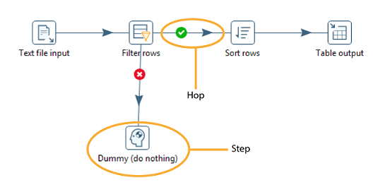

- 

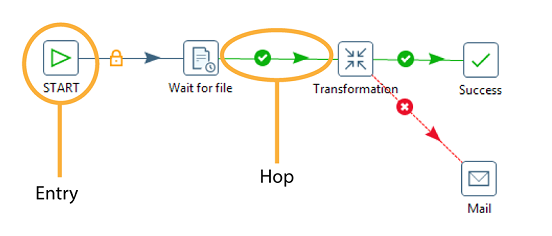

## Utilización de PDI: Iniciando el camino hacia la integración de datos
Para ingresar a Report Designer, debemos descomprimir la carpeta descargada desde la web de [Hitachi Vantara](https://community.hitachivantara.com/docs/DOC-1009856-pentaho-reporting) y ejecutar el archivo report-designer (.sh en Ubuntu y .bat en Windows) luego de configurar la variable JAVA_HOME como se explica [aquí.](https://www.dropbox.com/s/au05tj4qn63h8xx/GL00%20-%20Gu%C3%ADa%20de%20Instalaci%C3%B3n%20Suite%20Pentaho.pdf?dl=0)

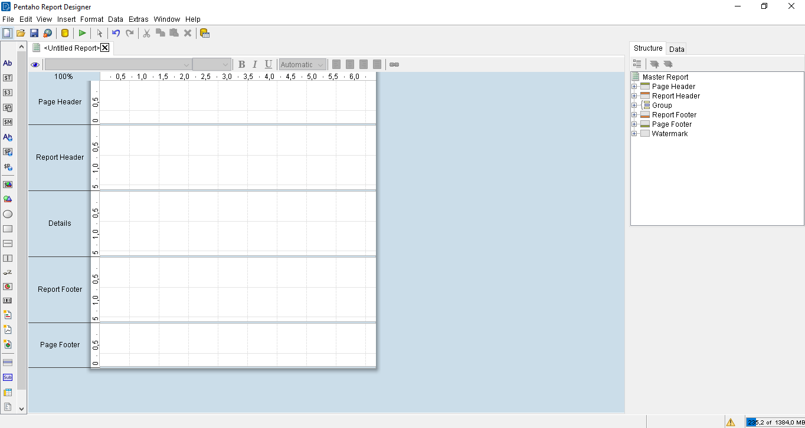

En la imagen se puede ver la distribución del home de la herramienta:
- A la izquierda, los diferentes componentes que podemos incorporar en nuestro reporte.
- En el centro, el paño en blanco que representa nuestro reporte y es donde vamos a incorporar los componentes y las definiciones.
- A la derecha podemos encontrar una columna con dos pestañas:
  - La primera, "Structure", donde podemos ver los componentes definidos para cada sección de nuestro reporte y definir todas las cuestiones inherentes al formato.
  - La segunda, "Data", donde vamos a definir los orígenes de datos desde los cuales vamos a consumir la información para los reportes.

__Ejemplo de la Guia:__ En esta guía vamos a graficar los conceptos desarrollando un reporte que liste y grafique (por especialidad) todos los medios de la provincia de Santa Cruz.

## Estructura de un Reporte
Los reportes en general, y en Report Designer en particular, tienen las siguientes secciones:

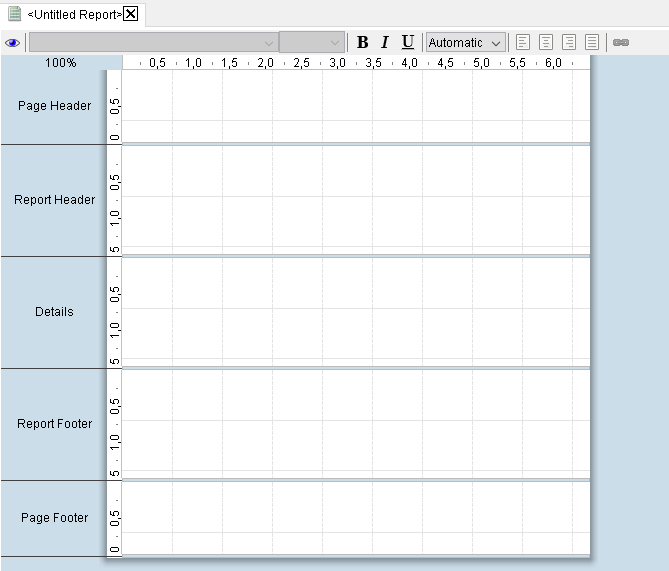

Las secciones se explican a continuación:
- __Page Header & Footer:__ Estas dos secciones representan los típicos encabezados y pies de páginas y suelen no modificarse a lo largo de un informe. En general, se utilizan para incorporar los logos institucionales, nombres de las áreas, números de páginas, fecha, etc.
- __Report Header, Details & Footer:__ Estas tres secciones son utilizadas para organizar los elementos de cada reporte. En general, el encabezado es utilizado para explicar la misión del reporte con un título y una breve explicación, mientras que en details puede observarse información desagregada, generalmente a partir de una tabla o detalle a la vez que en el pie del reporte generalmente se presenta algún gráfico que pueda sintetizar esa información o complementarla.

## Paso 1: Configurando los datasources de nuestro Reporte
Para configurar los datasources que serán consumidos para armar el reporte, debemos presionar el botón derecho sobre el ícono "Data Sets" de la pestaña Data (derecha de la pantalla).

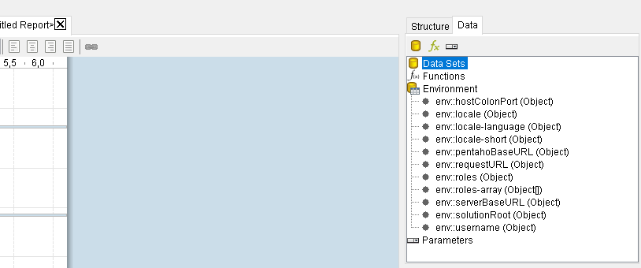

Luego, si por ejemplo deseamos conectarnos a una Base de datos relacional, el proceso será similar al que realizamos en CDE.

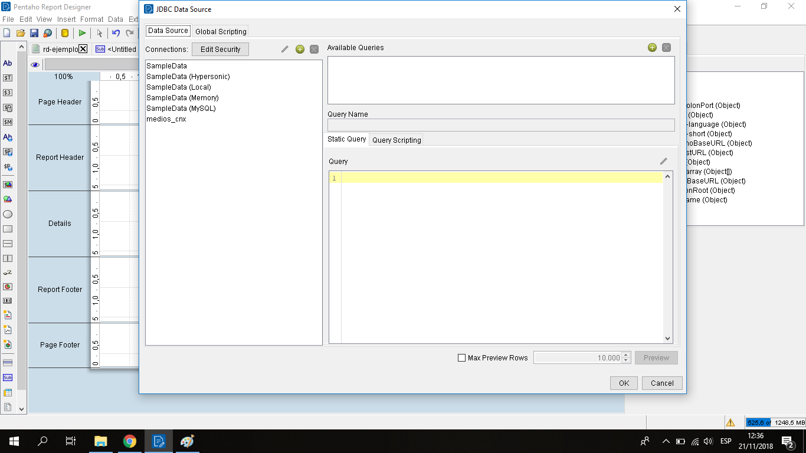

A continuación, vemos el editor del query SQL donde escribimos el query que recuperará la información que volcaremos en nuestro reporte; es importante hacer notar que cada componente espera la información de una manera distinta. 
Por un lado, para el listado de medios, vamos a seleccionar un conjunto de atributos de cada uno de los medios de la provincia de Santa Cruz:

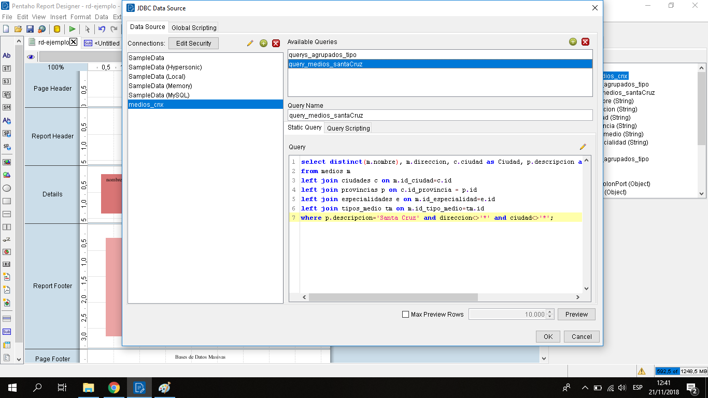

Por el otro, en el caso del gráfico de torta, que es el ejemplo que vamos a trabajar, el componente espera que le enviemos la información con una lista de etiquetas (leyenda de la barra) y un valor cuantitativo para cada etiqueta (alto de la barra).

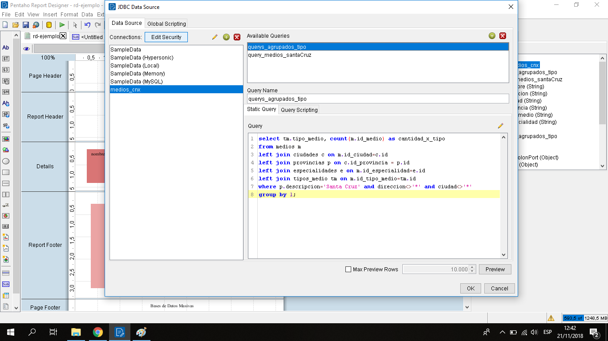

## Paso 2: Creando los labels del Reporte
Una vez configurados los orígenes de datos, vamos a avanzar en la renderización de nuestro reporte. Para ello, podemos insertar imágenes y labels como en casi cualquier otro editor de textos/reportes:

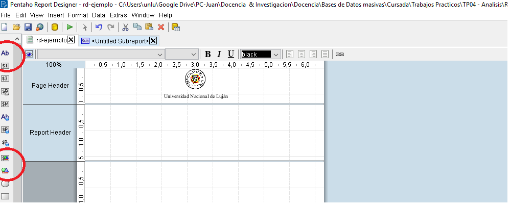

## Paso 3: Creación de componentes
Ahora, vamos a crear los componentes de nuestro reporte. Es importante hacer notar que si nuestro reporte va a tener mas de un componente, vamos a tener que asignar subreportes, uno por cada componente, dado que estos se configuran de manera individual en cada caso.

Para la creación de subreports, debemos arrastrar el componente hacia el paño del reporte. Una vez que hagamos esto, vamos a manejar cada subreport como un reporte separado.

Por ejemplo, si queremos crear nuestro reporte con el listado de medios de Santa Cruz debemos tomar los atributos del query generados antes y arrastrarlos hasta la sección "Details", del subreport creado antes. A su vez, definimos los encabezados del listado, en la sección "Report Header":

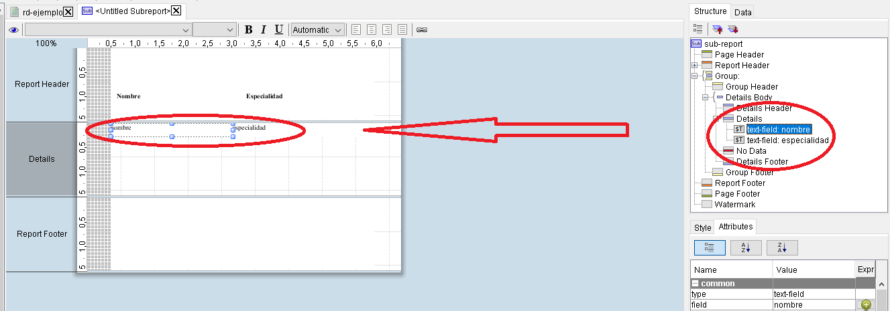

Por otro lado, creamos otro subreport para el gráfico que muestre la cantidad de medios por especialidad en un gráfico de barras. Luego, volcamos el componente dentro del subreport en la sección "Report Footer":

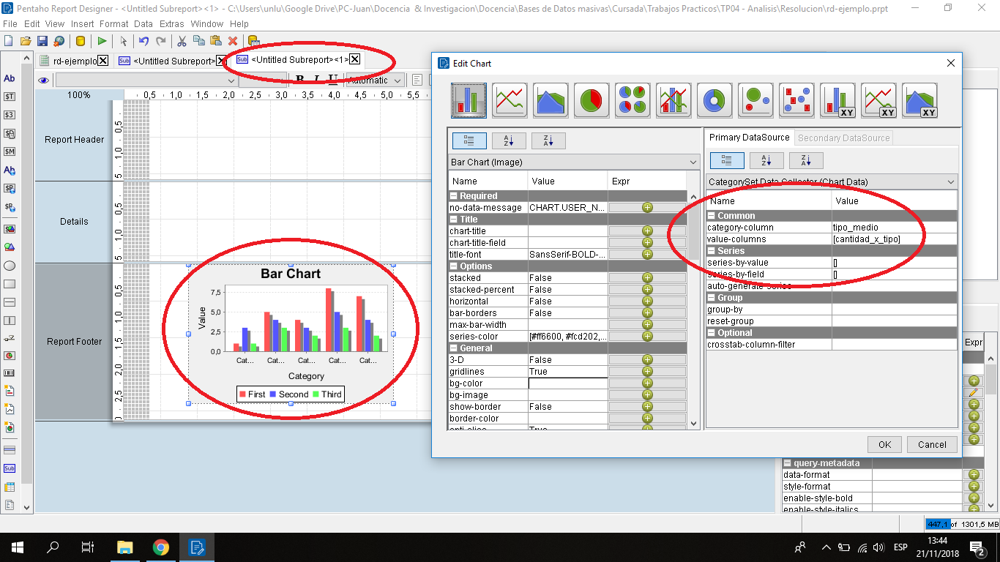

Luego, como se ve en el gráfico, haciendo doble click en el componente vamos a configurar cual es el atributo que se asigna a la etiqueta y cual atributo se asigna como cantidad.

Una vez que finalizamos el diseño de nuestro reporte podremos pre-visualizarlo o exportarlo a varios de los formatos mas conocidos como html, pdf, ods, etc...

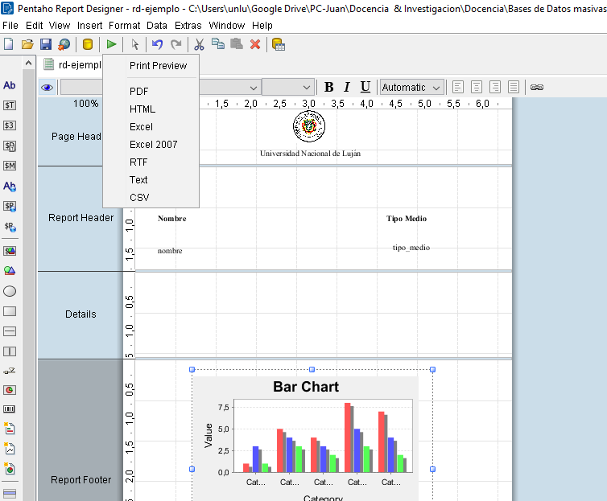

Hasta aquí un breve instructivo con la utilización de Report Designer de Pentaho.
