# Guía de LABORATORIO: Definición de cubos multidimensionales con Pentaho Schema Workbench (Mondrian)

## Introducción

### Conceptos iniciales

Mondrian Schema Workbench es una herramienta con una interfaz visual para crear cubos OLAP para luego procesar, a través del motor Mondrian, las solicitudes MDX contra esquemas ROLAP (Relacional OLAP, como vimos en clase). 
La herramienta genera estos esquemas a través de la denifición de modelos sobre los metadatos del esquema ROLAP en un archivo XML que consta de una estructura específica. Estos modelos XML pueden considerarse estructuras en forma de cubo que utilizan las tablas de hechos y dimensiones que se encuentran en el Sistema Gestor de Base de Datos Relacional utilizado (en el ejemplo que sigue será  MySQL). 
Como abordamos de forma teórica, los esquemas ROLAP no requieren que se construya o mantenga un cubo físico real; solo se crea el modelo de metadatos, que hace las veces de "cubo lógico".

### Requerimientos de Mondrian

Para empezar con el desarrollo del cubo es necesario:
- Tener Java instalado en la máquina (jdk de 64 bits, que ya viene con JRE).
- Configurar las variables de entorno JAVA_HOME (JDK) y JRE_HOME (JRE) ().
- Descargar Mondrian Schema Workbench.
- Instalar un SGBD relacional y descargar su correspondiente driver (en este ejemplo vamos a utilizar MySQL).

### Ejecución de Schema Workbench

Para correr la aplicación, hay que ejecutar la siguiente línea:
- workbench.sh (Ambientes Unix),
- workbench.bat (Ambientes Windows).

----

## Creación y Navegación de Cubos OLAP a través de Mondrian y Saiku (Suite Pentaho) 

El objetivo de esta guía es abordar los siguientes temas paso a paso:
1. Definir un cubo a partir de Schema Workbench (Modelo ROLAP),
2. Navegar el cubo con un Explorador OLAP (Saiku).

Para el abordaje de los temas anteriores, vamos a trabajar a partir de un _esquema de estrella_ para un cubo que permitir realizar análisis respecto de algunas características de los Estudiantes de la UNLu. Como vamos a trabajar sobre un Modelo ROLAP, asumiremos que partimos de una Base de Datos Relacional de MySQL con la siguiente estructura:

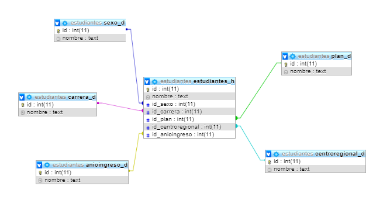

### Paso 1: Creación del cubo mediante Mondrian

1. Lo primero que debemos hacer es configurar es la conexión a la base de datos donde se encuentra nuestro modelo físico de la Base de Datos. En este caso, trabajaremos con MySQL, en el caso de utilizar otra base de datos debemos descargar el correspondiente driver Java y colocarlo en la carpeta __schema-workbench/drivers__. Accedemos a la configuración de la conexión de la Base de Datos a partir de la opción _Options > Connection..._ e ingresamos los datos correspondientes al acceso a la Base de Datos:

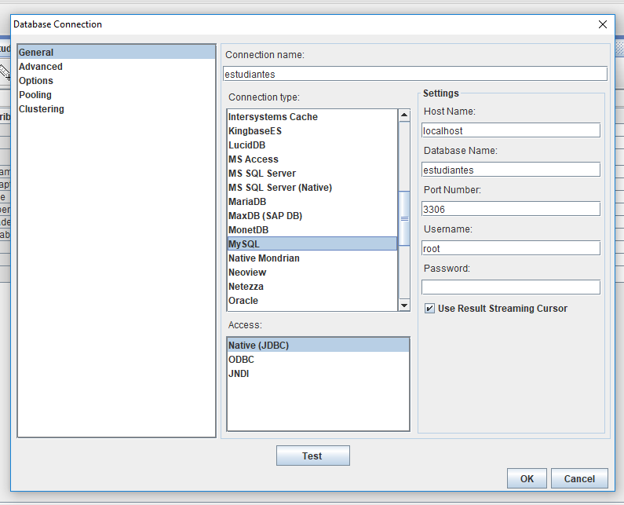

2. Una vez realizada la conexión, debemos crear el Esquema, para ello ingresamos desde la opción _File -> New -> Schema_. Aquí es importante hacer notar que un Schema es el ambiente del Data Warehouse y, como vimos en la clse teórica, un DW puede estar compuesto de múltiples cubos.

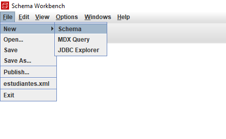

3. Luego, definimos el nombre que va a identificar a nuestro esquema (DW):

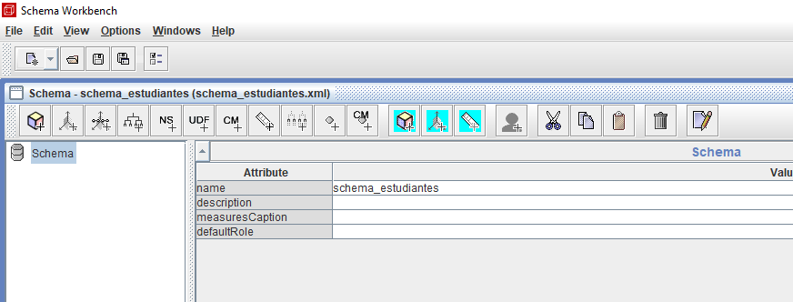

__Muy importante:__ En este ejemplo, incorporaremos las dimensiones fuera del Cubo que vamos a definir dado que esto será beneficioso en esquemas más complejos en los que necesitamos más de un cubo y es probable que necesitemos compartir las dimensiones. Si definieramos las dimensiones dentro del cubo, deberíamos definirlas cada vez que creemos uno nuevo. 
Si quisieramos definir las dimensiones dentro del cubo, previamente a la definición de las mismas crearemos el cubo a partir de la opción "Add cube" que aparece cuando presionamos click derecho sobre el Schema.

5. Realizada la salvedad anterior, vamos a trabajar directamente sobre el Schema (para luego poder compartir las dimensiones). Iniciamos la definición a partir de las dimensiones:

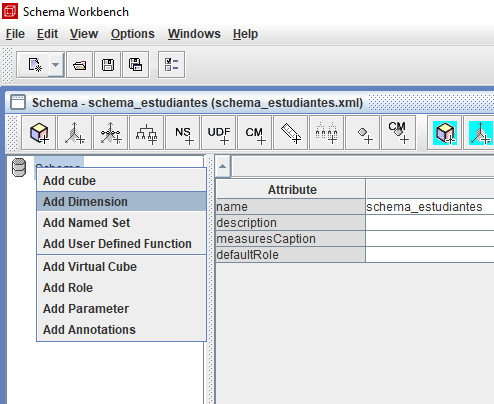

6. Dado que podemos definir dimensiones jerárquicas -como vimos en la clase teóricas-, por defecto Mondrian crea una jerarquía. En este caso vamos a dejarla con el nombre por defecto:

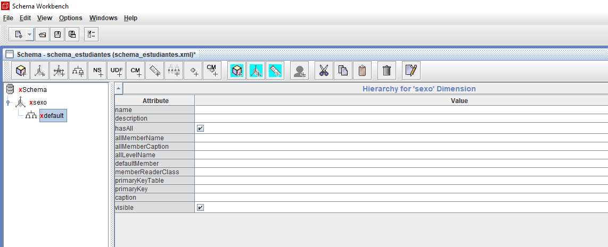

7. Ahora debemos definir cual es la tabla de la Base de Datos Relacional que corresponde a la dimensión:

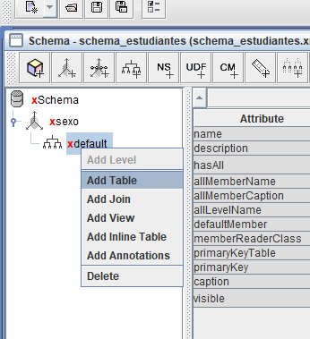

8. Vale aclarar que, si la conexión a la DB es correcta, la herramienta desplegará las tablas de la Base de Datos:

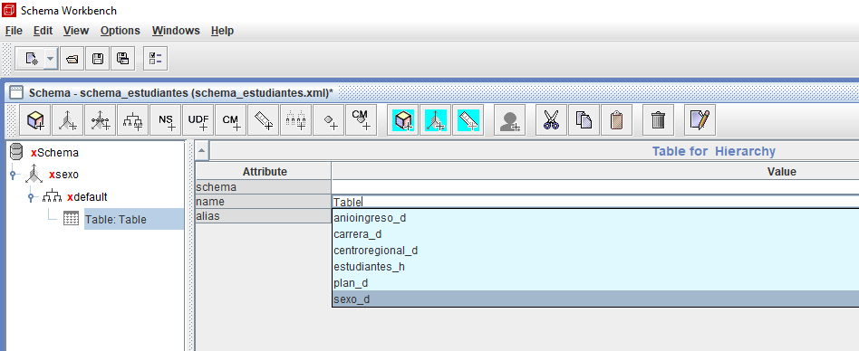

9. A continuación vamos a definir al menos un nivel (Level). Un nivel es cada uno de los atributos que representarán a una dimensión:

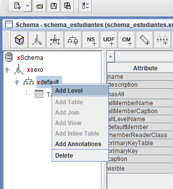

10. Aquí vamos a relacionar la tabla de la dimensión, en el campo _column_ va el identificador y el _nameColumn_ el campo descripción de la tabla:

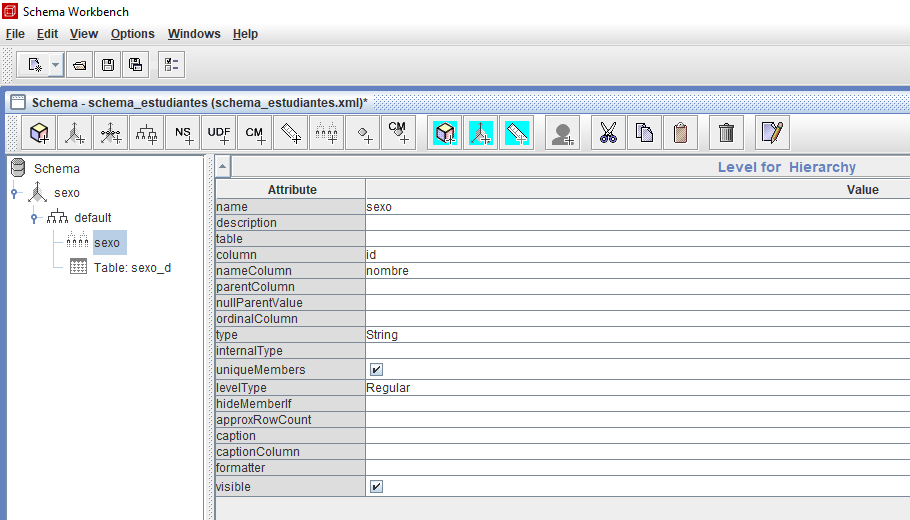

La operatoria anterior la haremos para todas las dimensiones del Ssquema.

11. Una vez que terminamos, vamos a agregar el cubo con la tabla de hechos y sus relaciones. Para ello, creamos un cubo y definimos su nombre de la tabla de hechos:

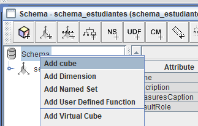

Creamos una tabla y seleccionamos la tabla de hechos

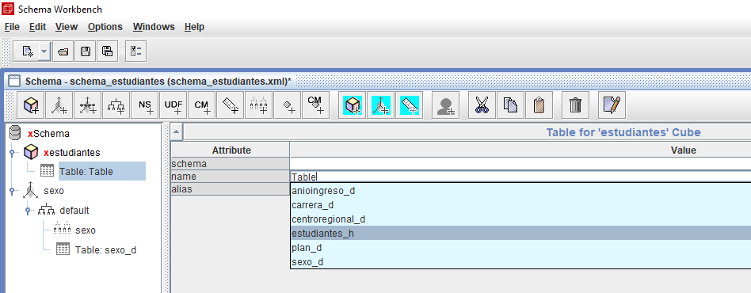

Ahora vamos a relacionar las dimensiones que creamos anteriormente

Seleccionamos la opcion dimension usage en vez de crear una normal, esto nos permite seleccionar las dimensiones que tenemos disponibles en el esquema

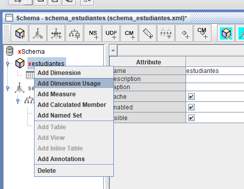

Le ponemos le nombre, seleccionamos la foreign key de la tabla de hechos que apunta a la tabla de la dimensión y en source, seleccionamos la dimensión que creamos anteriormente

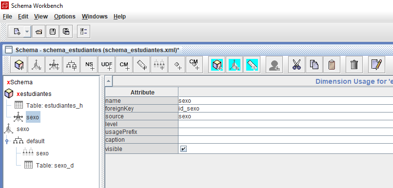

Hacemos esto con todas las dimensiones que creamos en el esquema

Lo que falta es definir las medidas que va a tener el cubo, vamos a agregar una que cuente la cantidad de alumnos.

Agregamos una medida

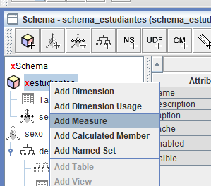

En el campo agregator, seleccionamos la función que se va a calcular para este campo

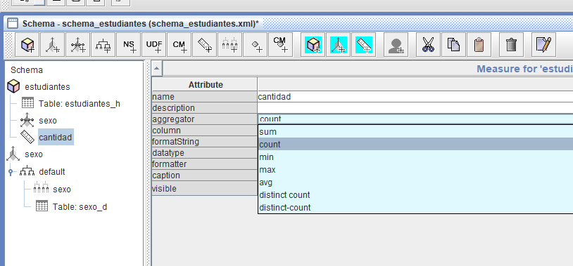

En el campo column, seleccionamos el campo con el que se va a realizar el cálculo, en este caso como sólo es contar, podría seleccionar cualquiera

Ya tenemos el cubo listo para publicar

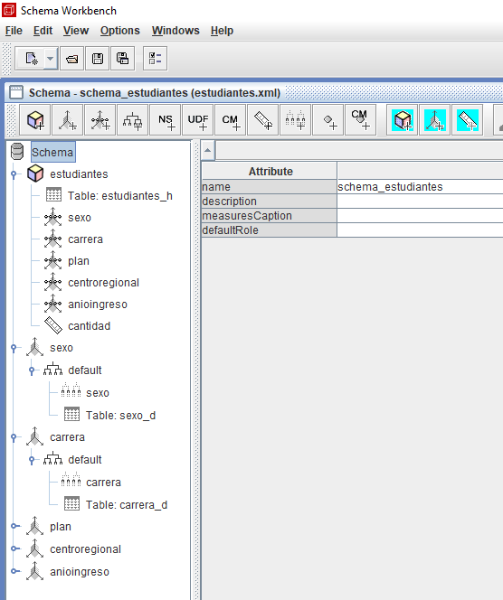

Vamos a publicar el cubo

Completamos los datos que apuntan al servidor de Pentaho y publicamos

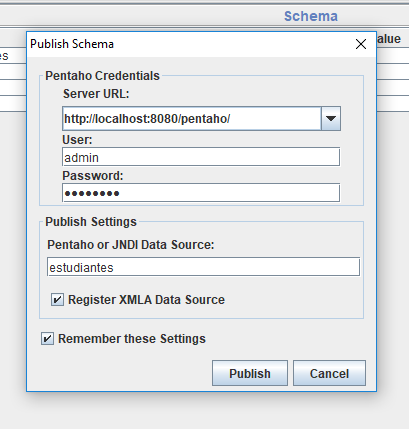

En Pentaho, aparece el cubo que acabamos de publicar para poder realizar en un análisis

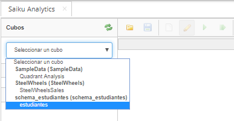

Con la herramienta Saiku, podemos mezclar las dimensiones y ver como se calcula la medida

Incluso podemos hacer gráficos con el mismo cruce de los datos

## Links

Driver MySQL

https://dev.mysql.com/downloads/connector/j/

Java JDK

https://www.oracle.com/java/technologies/jdk8-downloads.html

Mondrian

https://mondrian.pentaho.com/documentation/installation_es.php

https://mondrian.pentaho.com/documentation/workbench.php

https://help.pentaho.com/Documentation/8.1/Products/Schema_Workbench

Pentaho

https://www.hitachivantara.com/go/pentaho.html

https://help.pentaho.com/Documentation/8.1

Saiku

https://saiku-documentation.readthedocs.io/en/latest/
